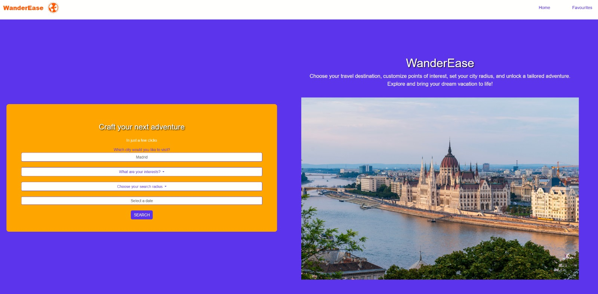

# WanderEase

WanderEase is a web application that taps into the capabilities of the OpenTripMap API, providing individuals with a tailored adventure planning experience. Users can specify their preferred city, interests, and search radius, resulting in the dynamic creation of a grid showcasing destinations complete with engaging images and detailed descriptions. This intuitive experience is facilitated through the integration of JavaScript, jQuery, Bootstrap, OpenTripMap API, OpenWeatherMap API and Flight data API.

# Usage
Deployed project URL: 

https://fumitsukai.github.io/Travel-Destination-Generator/

Presentation URL:

https://www.canva.com/design/DAF66qEwJuo/8hKOZ7iGlc7BqwnUq_a_2g/edit?utm_content=DAF66qEwJuo&utm_campaign=designshare&utm_medium=link2&utm_source=sharebutton

These screenshots show how the app appears in desktop view:

The user can complete the questionnaire and then click the search button to generate a results page tailored to their preferences, showcasing all the recommendations based on their selections.

When the user clicks the save button, the item will be added to their "favorites", allowing them to access it at any time, as it will be securely stored in local storage.

This screenshot illustrates how the app appears on mobile devices:

## License
MIT License

Copyright (c) [2024]

Permission is hereby granted, free of charge, to any person obtaining a copy
of this software and associated documentation files (the "Software"), to deal
in the Software without restriction, including without limitation the rights
to use, copy, modify, merge, publish, distribute, sublicense, and/or sell
copies of the Software, and to permit persons to whom the Software is
furnished to do so, subject to the following conditions:

The above copyright notice and this permission notice shall be included in all
copies or substantial portions of the Software.

THE SOFTWARE IS PROVIDED "AS IS", WITHOUT WARRANTY OF ANY KIND, EXPRESS OR
IMPLIED, INCLUDING BUT NOT LIMITED TO THE WARRANTIES OF MERCHANTABILITY,
FITNESS FOR A PARTICULAR PURPOSE AND NONINFRINGEMENT. IN NO EVENT SHALL THE
AUTHORS OR COPYRIGHT HOLDERS BE LIABLE FOR ANY CLAIM, DAMAGES OR OTHER
LIABILITY, WHETHER IN AN ACTION OF CONTRACT, TORT OR OTHERWISE, ARISING FROM,
OUT OF OR IN CONNECTION WITH THE SOFTWARE OR THE USE OR OTHER DEALINGS IN THE
SOFTWARE.